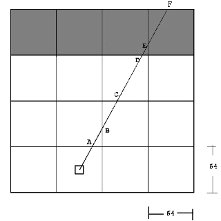

# cub3d

The goal of the project is to recreate a video game like Wolfenstein 3D using ray-casting.

## [Creating a World](https://permadi.com/1996/05/ray-casting-tutorial-3/#CREATING%20A%20WORLD)

The player gives the program a map. 

This map has some contraints because of the limitations of ray-casting, for example the floor must always be flat, the walls are made of cubes that have the same size (32x32 in our case) and the walls are always at 90° angle with the floor.

The map must be composed of only these 6 characters: 0 for empty spaces, 1 for walls and N,S,E or W which represent the starting position of the player and his orientation. Of course, the map must be closed.

Example of a working map :

```bash
NO ./path_to_the_north_texture
SO ./path_to_the_south_texture
WE ./path_to_the_west_texture
EA ./path_to_the_east_texture
F 220,100,0
C 225,30,0

1111111111111111111111111
1000000000110000000000001
1011000001110000000000001
1001000000000000000000001
111111111011000001110000000000001
100000000011000001110111111111111
11110111111111011100000010001
11110111111111011101010010001
11000000110101011100000010001
10000000000000001100000010001
10000000000000001101010010001
11000001110101011111011110N0111
11110111 1110101 101111010001
11111111 1111111 111111111111
```

## [Defining Projection Attributes](https://permadi.com/1996/05/ray-casting-tutorial-4/)

We shall define some attributes arbitrarily before startnig the project, such as the player Fielf-Of-View (FOV), the window size, etc. 

```c
# define NORTH 90
# define SOUTH 270
# define EAST 0
# define WEST 180
# define WIN_W 1280
# define WIN_H 640
# define FOV 60.0
# define TILE 32
# define WALL_RES 32
```

## [Finding Distance To Projection Plane](https://permadi.com/1996/05/ray-casting-tutorial-5/)

By knowing the FOV and the dimension of the projection plane (the window size), we can calculate the angle between subsequent rays and the distance between the player and the projection plane.

`game->ratio = TILE * ((WIN_W / 2) / tan(deg_to_rad(FOV / 2)));`

<aside>
💡 tan() method **expects the number in radians.** In our case, FOV is in degrees, you must multiply it by Pi/180 to convert it to radians.

</aside>

## [Finding Walls](https://permadi.com/1996/05/ray-casting-tutorial-6/)

Instead of tracing a ray for every pixel on the screen, we can trace for only **every vertical column** of screen. This way, instead of checking each pixels, we only have to check each grid. 



```c
void    raycasting(t_game *game)
{
   game->column = 0;
	 //p.vis (vision) is the orientation of the player.
	 //if the player is facing NORTH, p.vis = 90
   game->rays.ang = game->p.vis + FOV / 2;
	 while (game->column < WIN_W)
   {
			...
      game->h_res = horizontal_raycasting(game);
      ...
      game->v_res = vertical_raycasting(game);
			...
      draw(game);
      game->rays.ang -= FOV / (double)WIN_W;
      game->column++;
		  //we repeat the steps above WIN_W times (1280 in our case)
   }
}
```

## [Finding Distance to Walls](https://permadi.com/1996/05/ray-casting-tutorial-8/)

```c
double  horizontal_raycasting(t_game *game)
{
   game->rays.tan = tan(deg_to_rad(game->rays.ang));
	 //if ray is facing up, result will be negative
   if (game->rays.ang > EAST && game->rays.ang < WEST)
   {
      game->rays.step_y = -TILE;
      game->rays.hit_y = floor(game->p.y / TILE) * TILE - 0.00001;
   }
	 else
      //same but if the ray is facing down (positive)
	 ...
   //get the coordinate of the horizontal wall hit
   game->rays.hit_x = game->p.x
      + (game->p.y - game->rays.hit_y) / game->rays.tan;
   ...
   //repeat the operations until the ray hits a WALL
   digital_differential_analyzer(game);
   //returns the corrected distance between the player and the WALL from the projected ray
   return (sqrt(square((game->p.x - game->rays.hit_x))
         + square((game->p.y - game->rays.hit_y))));
}
```

About the return value :

Returning the difference between the player and the WALL will result in a ‘Fishbowl effect’ such as illustrated below. To avoid this distortion, we must normalize the distance. 

`game->rays.dist *= cos(deg_to_rad(game->p.vis - game->rays.ang));`


## [Drawing Walls](https://permadi.com/1996/05/ray-casting-tutorial-9/)

Before drawing the walls, we must know the height of the wall to determine the start and the end of the drawing. 

```c
game->rays.length = game->ratio / game->rays.dist;
game->start = game->p.height - game->rays.length / 2 + 1;
game->end = game->p.height + game->rays.length / 2;
```

## Drawing floor and ceiling

We decided not to add vertical rotation therefore we simply had to draw two big rectangles of a predifined color for the ceiling and the floor.

- `put_pixel` of a defined color when `y == WIN_H / 2`

<aside>
💡 Depending on your game engine, you might wanna convert colors into HEX for the next step.

</aside>

## [Texture Mapped Walls](https://permadi.com/1996/05/ray-casting-tutorial-10/)

We know how to draw colors, let’s draw some images now. Walls are made of **bitmap slices**. What the heck does this means ? A bitmap is a type of memory organization or image file format used to store digital images. 

Let’s take the example of this 16x16 image of a beautiful sun (left) and convert it into XPM (image file format) to see how it looks :


```c
/* XPM */
static char *_d53c27239cc4dddc392e03137bfcae0brjpUVI1MGnnAugU[] = {
/* columns rows colors chars-per-pixel */
"16 16 3 1 ",
"  c black",
". c yellow",
"X c white",
/* pixels */
".XXXX.XXXX.XXXX.",
"X.XXXX....XXXX.X",
"XX.X........X.XX",
"XXX..........XXX",
"XX............XX",
".X... .... ...X.",
"X..............X",
"X..............X",
"X..............X",
"X..............X",
".X.... .. ....X.",
"XX.....  .....XX",
"XXX..........XXX",
"XX.X........X.XX",
"X.XXXX....XXXX.X",
".XXXX.XXXX.XXXX."
};
```

The position of the ray relative to the grid (also called offset) can then be used to determine which column of the bitmap is to be drawn as the wall slice. We simply have to `x % TILE`

<aside>
✅ The further the wall is from the player, the fewer slices will be drawn.

</aside>

## [Horizontal Motion / / Making the Player Move](https://permadi.com/1996/05/ray-casting-tutorial-15/)

```c
#  define MS 5 //movement speed
#  define ROTATION 2.0
```

### Horitontal movement

Finding the displacement based on player’s speed.

$Displacement(x, y) = playerPos(x, y) + cos(α) * MS$

### Horizontal rotation

The process of turning is very simple to implement. All we need to do is to add or subtract an angle increment to the current player’s viewing angle. The smaller, the smoother.